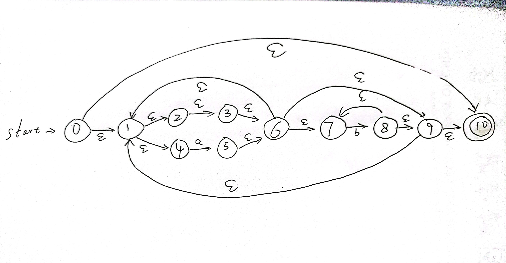
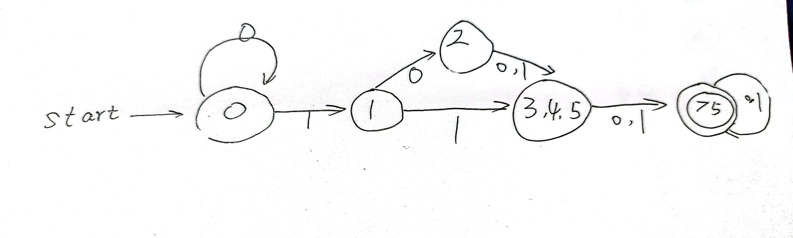

# HW1
## PB21111686_赵卓

### 2.1
- 0-9 a-z A-Z
- 空格 制表符
- ！ " # % ' ( ) * + , - . / : ; < = > ? [ \ ] ^ _ { } ~ |
  
### 2.2
- \<long>
- \<id , gcd>
- \<(>
- \<id , p>
- \<,>
- \<id , q>
- \<)>
- \<{>
- \<if>
- \<op , AND>
- \<op , EQ>
- \<number , 0>
- \<return>
- \<;>
- \<else>
- \<op , MOD>
- \<}>
  
### 2.3.a
- 正规式0(0|1)*0表示字母表{0 , 1}上以0开始并以0结尾的长度大于等于2的串的集合

### 2.4.h
- 所有不含子串001的0和1的串的正规定义为1*(0|01)*
  
### 2.7.c
- 处理输入串ababbab的状态转换序列为0-1-4-5-6-7-8-9-1-4-5-6-7-8-7-8-9-1-4-5-6-7-8-9-10

### 2.15
- 状态名为其字符串对应的十进制整数
