# Lab4_report

## PB21111686_赵卓

### 实验目的
- $掌握Mem2Reg的优化思路。$
- $了解中间代码优化的原理。$
- $提升代码实践能力。$
  
### 实验步骤
- $步骤零：找到每个函数中，每个bb块的控制边界。$
  $bb块的控制边界是指该bb块的后续bb块中，有多个前置bb块的bb块。因此对于此类bb块，$
  $控制流来自不同的bb块，因此需要在这些bb块的开头插入phi指令，实现变量的正确赋值。$
  $我们对每个函数遍历所有bb块，对于前置bb块数量大于1的bb块，将其加入每个前置bb块的$
  $控制边界即可。实现代码如下：$
  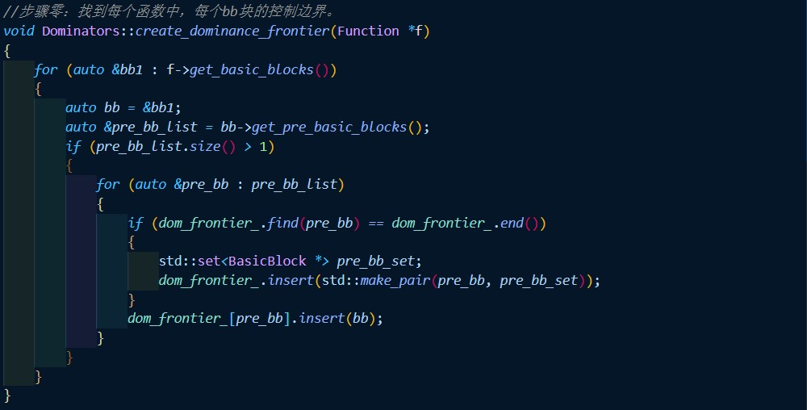
   

- $步骤一：找到活跃在多个bb块的全局名字集合，以及它们所属的bb块。$
  $“全局名字”的意思并非是指全局变量，而是在某个函数中出现在多个bb块的alloca指令。对$
  $于这些alloca值，在不同bb块中取不同的值，需要设置栈存放值，以及可能需要phi函数。我$
  $我们对每个函数遍历所有的bb块，如果是alloca指令，则将其加入全局名字集合，并为改名字$
  $设置所属bb块集合，如果后续bb块中出现了该名字，则将该bb块加入其所属bb块集合。实现代$
  $码如下:$
  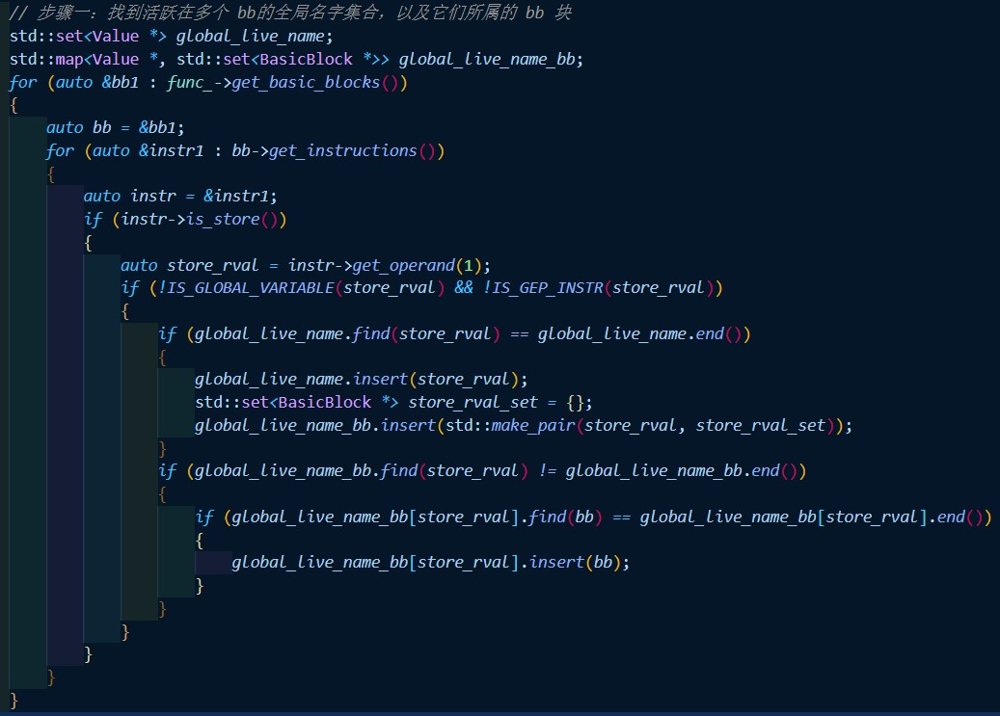
   
- $步骤二：通过支配边界信息，在对应位置插入phi指令。$
  $对于每个函数，遍历活跃在多个bb块的全局名字集合的所属bb块，在其支配边界的开头插入对$
  $应全局名字的phi指令。同时注意，插入phi指令后，该支配边界也成为的全局名字所属bb块，$
  $因此对其进行同样的操作。实现代码如下：$
  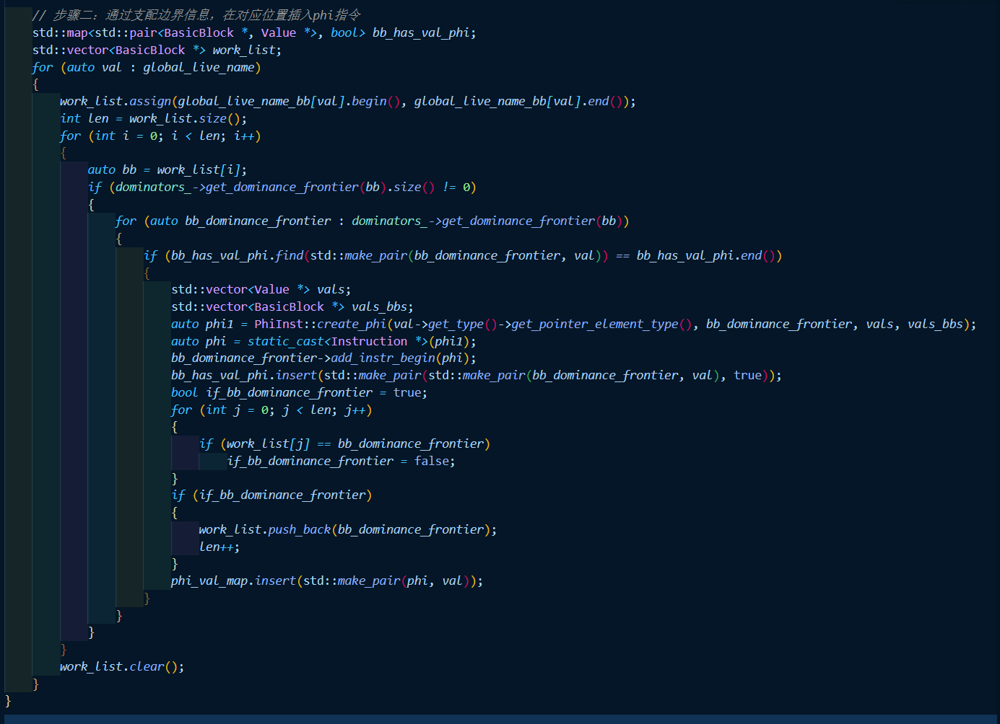
   
- $步骤三：判断是否需要回溯。$
  $由于对bb块递归进行重命名，可能出现某bb块中全局名字值是来自其他bb块，但该bb块还没有$
  $进行重命名或者其栈值已经被弹出。因此我们记录下每个bb块退出重命名时的栈情况，对于当前$
  $bb块的load指令，如果其对应栈为空，那么则遍历前置bb块的栈，如果找不到load指令对应的值$
  $，则需要回溯，先对其他bb块进行重命名。实现代码如下：$
  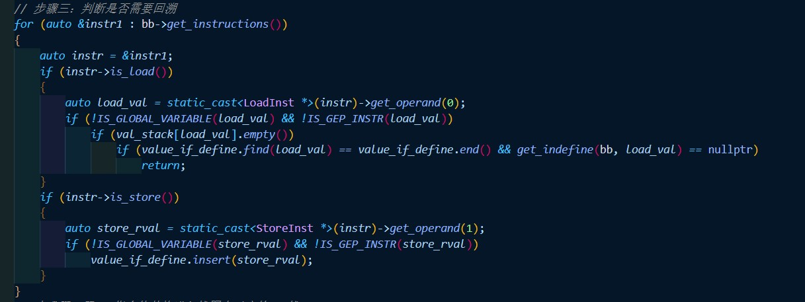
   
- $步骤四：用phi指令值替换进入栈图中对应的val栈。$
  $将phi指令值push入对应val值的栈即可。实现代码如下：$
  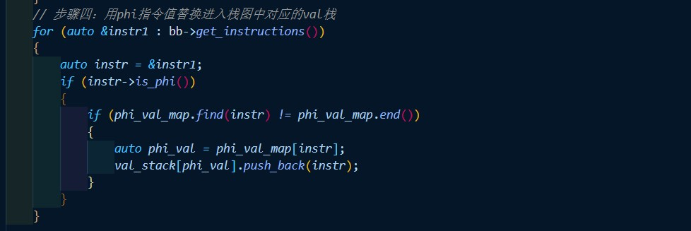
   
- $步骤五：将load的值替换，若不存在则从前置bb块中寻找。$
  $将所有load指令值替换成对应栈顶值，如果栈空，那么从前置bb块的栈中寻找。实现代码如下：$
  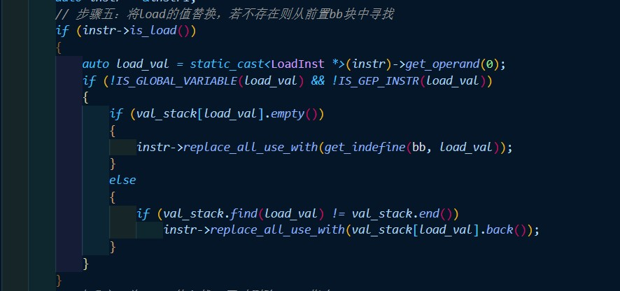
   
- $步骤六：将store值入栈，同时删除store指令。$
  $将store指令值push入对应val值的栈即可，实现代码如下：$
  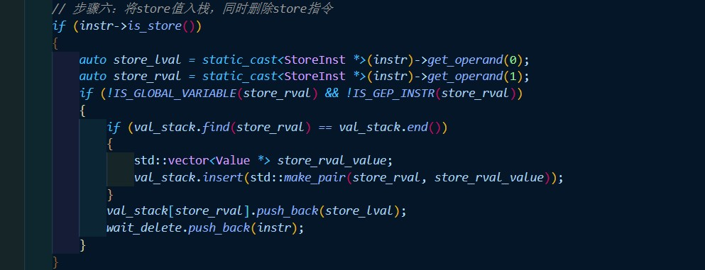
   
- $步骤七：补全后续bb块的phi指令。$
  $对当前bb块重命名结束之后，再遍历后续bb块，如果存在phi指令，说明后续bb块对应phi指令值$
  $的一个来源是当前bb块，在步骤二中已经设定。因此将对应phi指令值的栈顶值插入phi指令即可。$
  $实现代码如下：$
  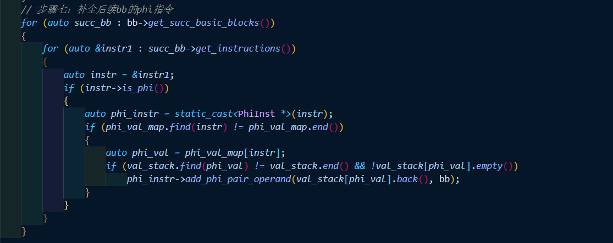
   
- $步骤八：对后续bb块递归进行重命名。$
  $每次重命名完bb块后，记录其命名情况，已经命名或者没有命名。对于后续没有命名的bb块依次进$
  $重命名。实现代码如下：$
  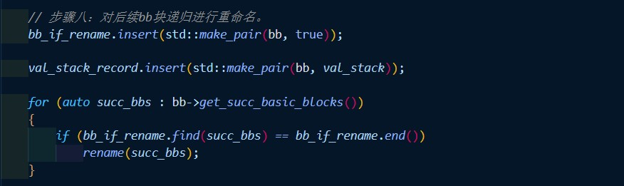
   
- $步骤九：结束当前bb块重命名，弹出栈值。$
  $结束当前bb块重命名后，由于要回到控制流到达该bb块之前的情况，因此遍历bb块的指令，将其对$
  $所有val指的栈的修改还原，弹出push入的栈值。实现代码如下：$
  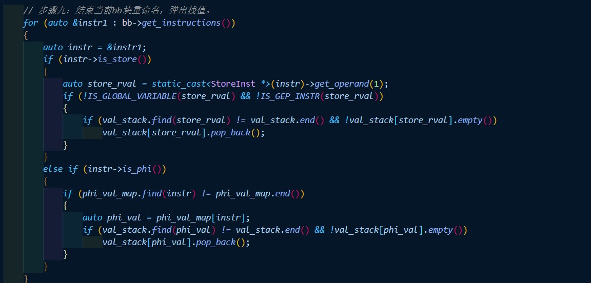
   
- $步骤十：删除store指令$
  $删除当前bb块的store指令，Deadcode会将对应的load和alloca死代码删除。实现代码如下：$
  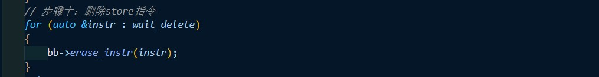
   
- $步骤十一：补全对phi指令的后端翻译$
  $后端应该可以将phi指令翻译成对应汇编语言。若在遍历到phi指令时直接翻译，困难较大，因为寻$
  $找前置bb块难度较大，而且此时对应val值也可能改变。因此我们变换思路，在个bb块翻译结束后，$
  $对后继bb块遍历，如果存在phi指令，那么说明后续bb块的phi指令值来自当前bb块，因此将后续bb块$
  $所需val值赋给其phi指令值。实现代码如下：$
  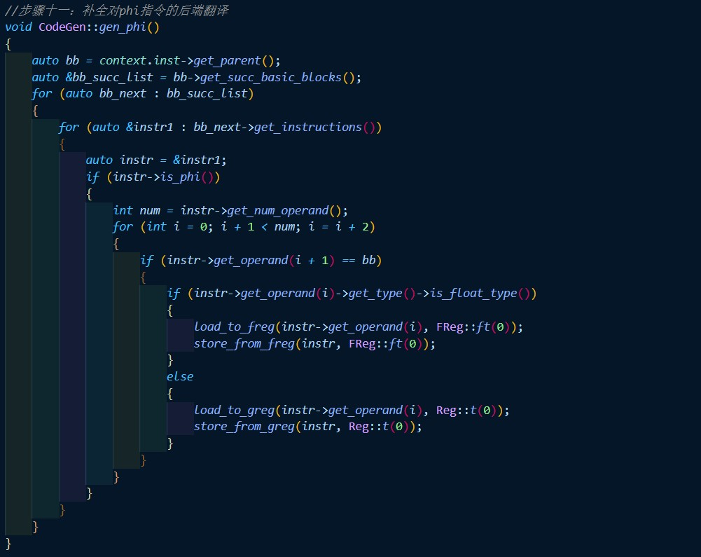
   
### 正确性验证
- $测试结果如下：$
  

### 性能优化验证
- $优化结果如下：$
  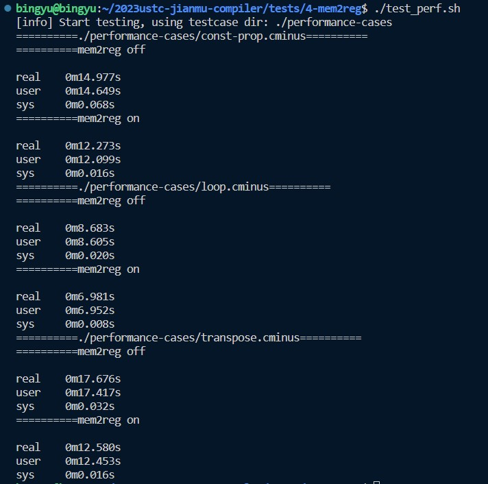
  $可见Mem2Reg会进行有效的优化。$

### 实验总结
- $本次实验在前置实验的基础上，进行来中间代码的优化，并采用Mem2Reg方法。由优化结果可以看出，$
  $Mem2Reg方法进行了较为有效的优化，但优化程度存在提升空间，思考如何进行进一步的优化是有意义$
  $的。$